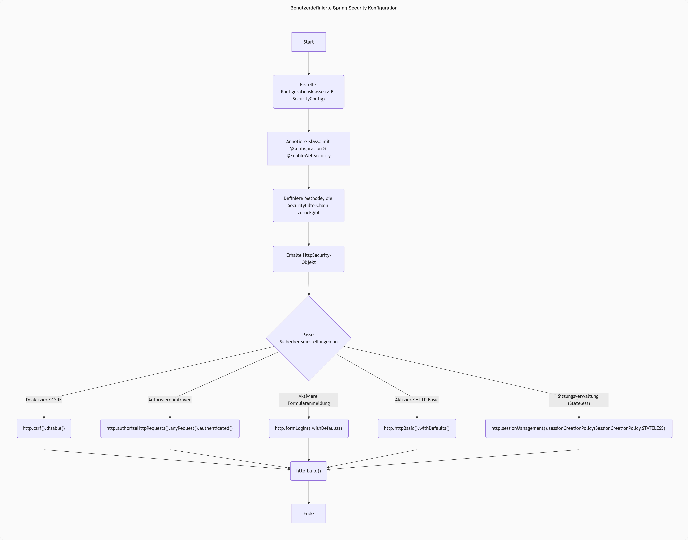

## Benutzerdefinierte Spring Security Konfiguration
- Standardmäßig bietet Spring Security eine **Filterkette** mit vordefinierten Einstellungen, die durch das Hinzufügen der Abhängigkeit aktiviert werden.
- Um diese Standardkonfiguration anzupassen, wie z.B. die Verbindung zu einer Datenbank oder das Deaktivieren der Formularanmeldung, muss eine eigene Konfigurationsklasse erstellt werden.

### Erstellen einer benutzerdefinierten Konfigurationsklasse
- Eine neue Klasse, z.B. `SecurityConfig`, sollte in einem `config`-Paket erstellt werden.
- Diese Klasse muss mit `@Configuration` annotiert werden, um Spring mitzuteilen, dass es sich um eine Konfigurationsdatei handelt.
- Die Annotation `@EnableWebSecurity` muss ebenfalls hinzugefügt werden, um die Standard-Spring Security-Konfiguration zu deaktivieren und die eigene Konfiguration zu verwenden.

### Konfigurieren der Security Filter Chain
- Um die Sicherheitsfilterkette anzupassen, muss eine Bean zurückgegeben werden, die ein Objekt vom Typ `SecurityFilterChain` liefert.
- Diese Methode sollte ein `HttpSecurity`-Objekt als Parameter erhalten, welches zum Konfigurieren der Sicherheitsregeln verwendet wird.
- Das `HttpSecurity`-Objekt verfügt über eine `build()`-Methode, die das `SecurityFilterChain`-Objekt zurückgibt.
- Wenn keine Filter in der `SecurityFilterChain` definiert sind, wird standardmäßig keine Sicherheit angewendet, was bedeutet, dass alle URLs ohne Authentifizierung zugänglich sind.

Hier ist ein Flussdiagramm, das den Prozess der benutzerdefinierten Spring Security-Konfiguration darstellt:

---
### Anpassen der Sicherheitseinstellungen mit `HttpSecurity`
- Das `HttpSecurity`-Objekt wird verwendet, um verschiedene Sicherheitseinstellungen zu konfigurieren.

#### Deaktivieren von CSRF (Cross-Site Request Forgery)
- CSRF kann mit `http.csrf().disable()` deaktiviert werden.
- In Spring 6 wird dies oft mit einem `Customizer` und Lambda-Syntax (`http.csrf(Customizer.disable())`) oder imperativ implementiert.
- Das Deaktivieren von CSRF ist sinnvoll, wenn die Anwendung zustandslos gemacht wird, da dann keine Session-IDs verwaltet werden müssen.

#### Autorisieren von HTTP-Anfragen
- Um sicherzustellen, dass keine Seite ohne Authentifizierung zugänglich ist, wird `http.authorizeHttpRequests().anyRequest().authenticated()` verwendet.
- Dies führt dazu, dass der Zugriff auf den lokalen Host verweigert wird, wenn keine Authentifizierung erfolgt.

#### Aktivieren der Formularanmeldung
- Für die Browser-Anmeldung kann `http.formLogin().withDefaults()` aktiviert werden, um die Standard-Formularanmeldung zu verwenden.
- Wenn die Formularanmeldung aktiviert ist, wird bei jedem Zugriff auf eine neue Ressource eine Anmeldeformular angezeigt, da dies als neue Sitzung betrachtet wird.

#### Aktivieren der HTTP Basic Authentifizierung
- Für den Zugriff über REST-APIs (z.B. mit Postman) muss `http.httpBasic().withDefaults()` aktiviert werden.
- Dies ermöglicht die Authentifizierung über HTTP Basic und liefert bei jedem Request eine neue Session-ID.
- Wenn die Formularanmeldung deaktiviert ist, führt HTTP Basic im Browser zu einem Anmelde-Popup anstelle eines Formulars.

#### Sitzungsverwaltung
- Um die Anwendung zustandslos zu machen, kann `http.sessionManagement().sessionCreationPolicy(SessionCreationPolicy.STATELESS)` verwendet werden.
- In einem zustandslosen Modus müssen die Anmeldeinformationen bei jeder Anfrage übergeben werden, was die Formularanmeldung im Browser erschwert, aber gut mit Postman funktioniert.

### Builder-Muster für `HttpSecurity`
- Mehrere Konfigurationen können in einer Kette mit dem **Builder-Muster** angewendet werden, indem die Semikolons zwischen den `http`-Methoden entfernt und die Methoden direkt aneinandergereiht werden.
- Dies verbessert die Lesbarkeit und den Fluss der Konfiguration, da ein `HttpSecurity`-Objekt nacheinander durch verschiedene Konfigurationsmethoden geleitet wird.
- Die Kette endet mit `.build()` am Ende der Konfiguration.

### Funktionsweise von `Customizer`
- Methoden wie `csrf()` oder `authorizeHttpRequests()` erwarten ein Objekt vom Typ `Customizer`.
- `Customizer` ist ein funktionales Interface mit einer `customize`-Methode.
- Man kann ein `Customizer`-Objekt entweder über eine anonyme innere Klasse oder, da es ein funktionales Interface ist, über einen Lambda-Ausdruck erstellen.
- Die Lambda-Syntax (`Customizer.disable()`) ist eine vereinfachte Form der imperativen Implementierung des `Customizer`-Interfaces.