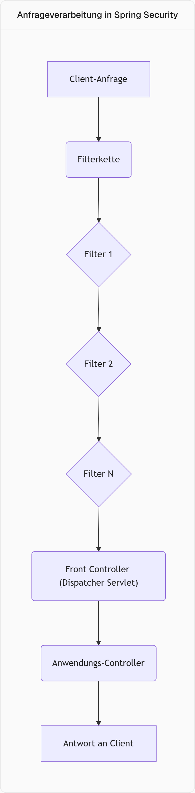
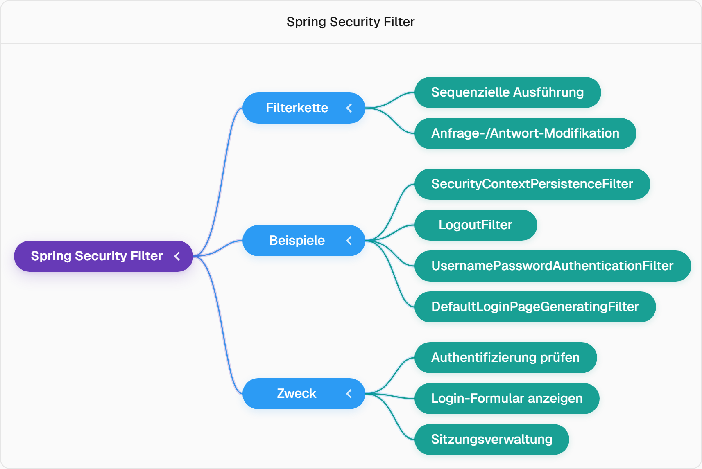
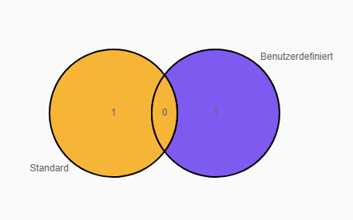

## Spring Security: Benutzerdefiniertes Login und Sitzungsverwaltung

### Standard-Login und Anpassungsbedarf
- Standardmäßig verwendet Spring Security den Benutzernamen „user“ und ein in der Konsole generiertes Passwort für das Login.
- Ziel ist es, diese Standardanmeldeinformationen anzupassen und die zugrunde liegenden Sicherheitsmechanismen zu verstehen.
- Wichtige Fragen betreffen die Handhabung der Sicherheit, die Funktionsweise von Sitzungen und die Möglichkeit, sich über REST-Clients wie Postman anzumelden.

### Anfrageverarbeitung und Sicherheitsfilter
- Im Spring Web werden Client-Anfragen an **Controller** gesendet, die auf einem **Servlet-Container** (z.B. Tomcat) laufen.
- Jede Anfrage durchläuft zuerst einen **Front Controller**, auch **Dispatcher Servlet** genannt, bevor sie die spezifischen Anwendungs-Controller erreicht.
- Vor dem Dispatcher Servlet befindet sich eine **Filterkette**, in die Spring Security eigene Filter einfügt, um die Sicherheit zu gewährleisten.
- Filter können Anfragen prüfen, modifizieren und entscheiden, ob ein Benutzer authentifiziert ist, bevor die Anfrage weitergeleitet wird.
- Der `UsernamePasswordAuthenticationFilter` ist beispielsweise dafür zuständig, das Login-Formular anzuzeigen, wenn ein Benutzer nicht angemeldet ist.
- Filter arbeiten sequenziell; ein Filter leitet die Anfrage an den nächsten in der Kette weiter (`do filter chain`).

Hier ist ein Flussdiagramm, das den Anfragefluss in Spring Security visualisiert:

Hier ist eine Mindmap der Spring Security Filter:

### Sitzungsverwaltung (Session Management)
- Nach erfolgreichem Login kann ein Benutzer auf verschiedene Seiten zugreifen, ohne sich erneut anmelden zu müssen, da eine **Sitzung** (Session) erstellt wird.
- Die **Sitzungs-ID** wird als Teil eines Cookies gespeichert und kann in den Entwicklertools des Browsers (Netzwerk-Tab) eingesehen werden.
- Jede neue Login-Instanz oder ein Wechsel des Browsers führt zur Generierung einer neuen Sitzungs-ID.
- Die aktuelle Sitzungs-ID kann im Code über `$$HttpServletRequest.getSession().getId()$$` abgerufen und ausgegeben werden.
- Das Löschen von Browser-Cookies führt automatisch zum Logout des Benutzers.

### Benutzerdefinierte Anmeldeinformationen
- Das Standard-Login kann durch das Hinzufügen spezifischer Eigenschaften in der Datei `application.properties` angepasst werden.
- Die relevanten Eigenschaften sind `spring.security.user.name` für den Benutzernamen und `spring.security.user.password` für das Passwort.
- Beispiel: `spring.security.user.name=naveen` und `spring.security.user.password=telusko`.
- Nach dem Neustart der Anwendung mit diesen Eigenschaften wird kein Standardpasswort mehr in der Konsole generiert.

Hier ist ein Venn-Diagramm, das die Unterschiede zwischen Standard- und benutzerdefinierten Anmeldeinformationen darstellt:

### Login über Postman (REST-Client)
- Ein REST-Client wie Postman kann verwendet werden, um sich bei der Anwendung anzumelden.
- Eine direkte Anfrage an die Homepage ohne Authentifizierung führt zu einem `401 Unauthorized`-Status.
- Die Authentifizierung erfolgt über den **Basic Auth**-Tab in Postman, indem der konfigurierte Benutzername und das Passwort gesendet werden.
- Ein erfolgreiches Login (Status `200 OK`) über Postman generiert ebenfalls eine neue Sitzungs-ID.