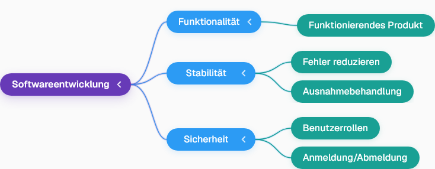
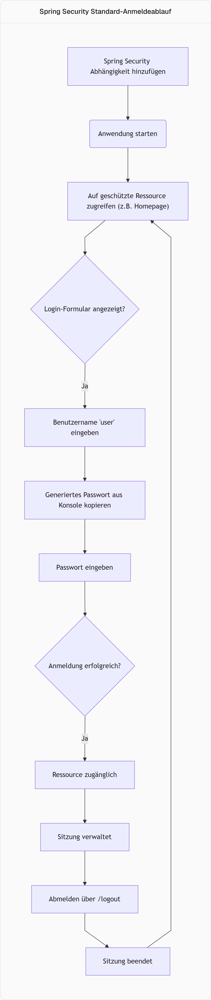

## Prioritäten in der Softwareentwicklung
- Bei der Softwareentwicklung stehen drei Hauptprioritäten im Vordergrund: Funktionalität, Stabilität und Sicherheit.
- Zuerst muss das Produkt **funktionieren**; ohne dies sind andere Aspekte irrelevant.
- Danach ist die **Stabilität** entscheidend, um sicherzustellen, dass die Software zuverlässig läuft und nicht plötzlich ausfällt.
    - Dies wird durch die Reduzierung von Fehlern, insbesondere größeren Fehlern, und durch die Behandlung von Ausnahmen erreicht.
- Die dritte und oft vernachlässigte Priorität ist die **Sicherheit**.

## Die Bedeutung von Sicherheit
- Sicherheit ist von entscheidender Bedeutung, sowohl im persönlichen Bereich (z.B. Fingerabdruck- oder Gesichtserkennung auf dem Telefon) als auch in Anwendungen.
- Ohne Sicherheitsmaßnahmen kann jeder auf ein Projekt zugreifen und beliebige Aktionen ausführen.
- In Anwendungen wie E-Commerce sind unterschiedliche **Benutzerrollen** (z.B. Verkäufer, Käufer) erforderlich, die sich anmelden müssen, um ihre spezifischen Aufgaben zu erfüllen.
- Die Implementierung von Sicherheit ohne ein Framework wie Spring kann sehr zeitaufwendig sein; ein Projekt, das 10 Stunden für die Entwicklung benötigt, könnte 20 Stunden für die Sicherung erfordern.

## OWASP Top 10: Web-Sicherheitsrisiken
- Um die Sicherheit von Anwendungen zu gewährleisten, gibt es das **Open Web Application Security Project (OWASP)**.
- OWASP veröffentlicht alle vier Jahre die **OWASP Top 10**, eine Liste der kritischsten Sicherheitsrisiken für Webanwendungen.
- Diese Liste hilft Entwicklern, bekannte Schwachstellen wie Probleme bei der Zugriffskontrolle, Kryptografie, Injektionsangriffe und Designfehler zu identifizieren und zu beheben.
- Die nächste Aktualisierung der OWASP Top 10 wird für 2025 erwartet.

## Spring Security: Vereinfachte Implementierung
- Frameworks wie **Spring Security** vereinfachen die Implementierung von Sicherheitsmaßnahmen erheblich.
- Spring Security kümmert sich standardmäßig um viele der in den OWASP Top 10 genannten Probleme und gibt Empfehlungen oder Einschränkungen, um die Anwendung sicherer zu machen.

## Erste Schritte mit Spring Security
- Um ein Projekt mit Spring Security zu starten, wird ein neues Maven-Projekt auf `start.spring.io` erstellt.
- Die erforderlichen Abhängigkeiten sind **Spring Web**, **Spring DevTools** und **Spring Security**.
- Nach dem Generieren und Entpacken des Projekts kann es in einer IDE wie IntelliJ IDEA geöffnet werden.
- Zunächst kann Spring Security in der `pom.xml` auskommentiert werden, um eine einfache Spring Boot-Anwendung ohne Sicherheit zu testen.
- Ein einfacher `RestController` mit einer `greet()`-Methode, die "Welcome to Telusko" zurückgibt, dient als zu schützende Ressource.

## Standardverhalten von Spring Security
- Durch das erneute Aktivieren der Spring Security-Abhängigkeit in der `pom.xml` und das Neuladen des Projekts wird die Anwendung sofort gesichert.
- Spring Security stellt automatisch ein **Login-Formular** bereit, wenn auf eine geschützte Ressource zugegriffen wird.
- Der Standard-Benutzername ist `user`.
- Das **Passwort wird beim Start der Anwendung in der Konsole generiert** und ist nur für die Entwicklung gedacht.
- Nach erfolgreicher Anmeldung verwaltet Spring Security die **Sitzung**, sodass der Benutzer nicht bei jeder Anfrage erneut anmelden muss.
- Eine **Abmeldefunktion** ist ebenfalls standardmäßig über die URL `/logout` verfügbar und beendet die Sitzung effektiv.

## Einschränkungen und nächste Schritte
- Das generierte Passwort ist **nur für die Entwicklung** gedacht und sollte nicht in der Produktion verwendet werden.
- Standardmäßig unterstützt Spring Security nur einen einzigen Benutzer mit dem generierten Passwort.
- Für mehrere Benutzer und benutzerdefinierte Passwörter ist die Integration einer **Datenbank** erforderlich, um Benutzerinformationen zu speichern.
- Obwohl ein einzelner Benutzername und ein Passwort in `application.properties` festgelegt werden können, ist dies ebenfalls auf einen einzelnen Benutzer beschränkt.